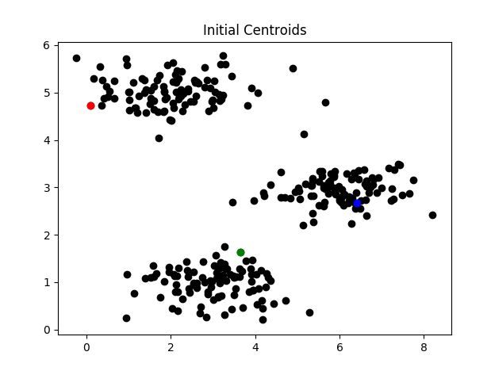
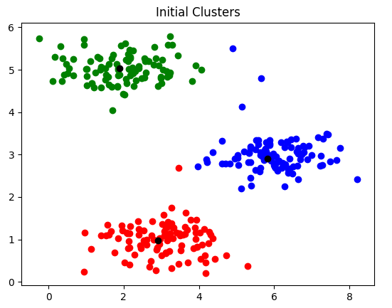
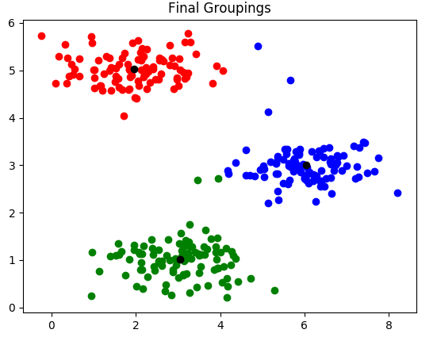

K Means Implementation in Python
================================

File Kmeans.py contains my implementation of the K-means classification
algorithm. To run the program, execute it as a python script followed by
the .csv file path containing the dataset you'd like to classify, and the number (k) of centroids, i.e. \$ python Kmeans.py data.csv
3

**Program limitations:**

-   Requires Pandas version 0.23.4 or greater. Older versions may work,
     but this was the version I used when programming the algorithm.

-   The dataset should be in .csv format.

-   The dataset can be in any dimension 1 or greater, but will only plot
     the outcomes for datasets of dimension 2xN (2D graph)

K Means algorithm
-----------------

The program begins by selecting *k* random points from the dataset to be
initial centroids. There are more robust ways of doing this, like
selecting one random point and then the furthest point from the first
one, then the furthest from those two, etc but completely random
selection will suffice for this project.

After initial points were randomly selected, the individual data points
are assigned according to the closest centroid. In the screenshot below,
the centroids were also updated to be the center of their group as well.

The groupings are considered converged when they no longer change from
one iteration to another. One example of final groupings are as such:

*Note: The above screenshots are all from different runs of the program.
Colors are not consistent between runs.*

Through one iteration of the algorithm, the following centroids were
calculated:
~~~
+----------------------------------------------+
| \[\[0.6025806834195966, 5.125601007188029\], |
|                                              |
| \[4.8191596229726885, 2.530011478230643\],   |
|                                              |
| \[1.9895920944633765, 3.484474457564766\]\]  |
|                                              |
| \[\[1.299030196427282, 5.0947617866586405\], |
|                                              |
| \[5.022181768194006, 2.1996948854581544\],   |
|                                              |
| \[2.4115505844821814, 3.2931931696489123\]\] |
|                                              |
| \[\[1.783664824646092, 5.059334131860873\],  |
|                                              |
| \[5.193207683391326, 2.286443810333612\],    |
|                                              |
| \[2.491022179190202, 1.807266316548767\]\]   |
|                                              |
| \[\[1.983631519927152, 5.030430038142128\],  |
|                                              |
| \[5.830521823004398, 2.7219089796400957\],   |
|                                              |
| \[2.8418657721040463, 1.0288857970763727\]\] |
|                                              |
| \[\[1.9539946648593862, 5.025570059426876\], |
|                                              |
| \[6.006085831149552, 2.9719754375208782\],   |
|                                              |
| \[3.012004424839671, 1.0048287816715875\]\]  |
|                                              |
| \[\[1.9539946648593862, 5.025570059426876\], |
|                                              |
| \[6.033667356017605, 3.0005251118352554\],   |
|                                              |
| \[3.043671192739813, 1.0154104079486548\]\]  |
|                                              |
| \[\[1.9539946648593862, 5.025570059426876\], |
|                                              |
| \[3.043671192739813, 1.0154104079486548\],   |
|                                              |
| \[6.033667356017605, 3.0005251118352554\]\]  |
+----------------------------------------------+
~~~
This algorithm converged in 7 iterations.
